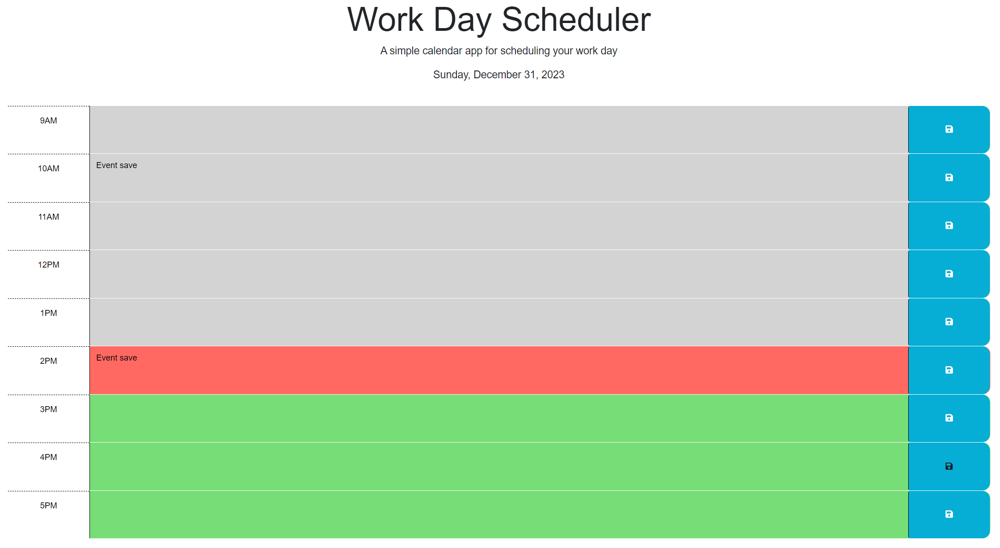

# Work Day Scheduler Starter Code

## Description
Welcome to the Work Day Scheduler! This application allows you to easily plan and organize your work day by saving events for each hour of a typical working day (9am to 5pm). With a user-friendly interface and dynamic updates, you can stay on top of your schedule and never miss an important task.

## User Story

AS AN employee with a busy schedule
I WANT to add important events to a daily planner
SO THAT I can manage my time effectively

## Acceptance Criteria

GIVEN I am using a daily planner to create a schedule
WHEN I open the planner
THEN the current day is displayed at the top of the calendar
WHEN I scroll down
THEN I am presented with time blocks for standard business hours of 9am to 5pm
WHEN I view the time blocks for that day
THEN each time block is color-coded to indicate whether it is in the past, present, or future
WHEN I click into a time block
THEN I can enter an event
WHEN I click the save button for that time block
THEN the text for that event is saved in local storage
WHEN I refresh the page
THEN the saved events persist

## Mock-Up
The following image shows the appearance and functionality of the Work Day Scheduler: 

## Deployed URL

https://ninabuscemi.github.io/work-day-schedule/

## Installation

To use the Work Day Scheduler, follow these steps:
1. Clone the repository to your local machine.
2. Open the index.html file in your preferred web browser.

## Usage

Once the Work Day Scheduler is open in your web browser, you can:

The current date is displayed at the top of the page.
Each hour of the work day is represented as a time block.

-Click on a time block to enter an event or task for that hour.
-Click the save button to save the event.
-The saved events will persist even if you refresh the page.
-The time blocks are color-coded to indicate past, present, and future events.

## Features

The Work Day Scheduler comes with several useful features to help you manage your work day effectively:

Dynamic time blocks: The time blocks update in real-time to reflect the current hour.
Persistent storage: Your saved events are stored locally and will be available even after closing and reopening the application.
Color-coded schedule: The time blocks are color-coded to provide a visual representation of past, present, and future events.
User-friendly interface: The application is designed to be intuitive and easy to use.

## Contributing

Contributions to the Code Quiz app are welcome! If you find any issues or have suggestions for improvements, please submit a pull request. Make sure to follow the repository's code style and guidelines.